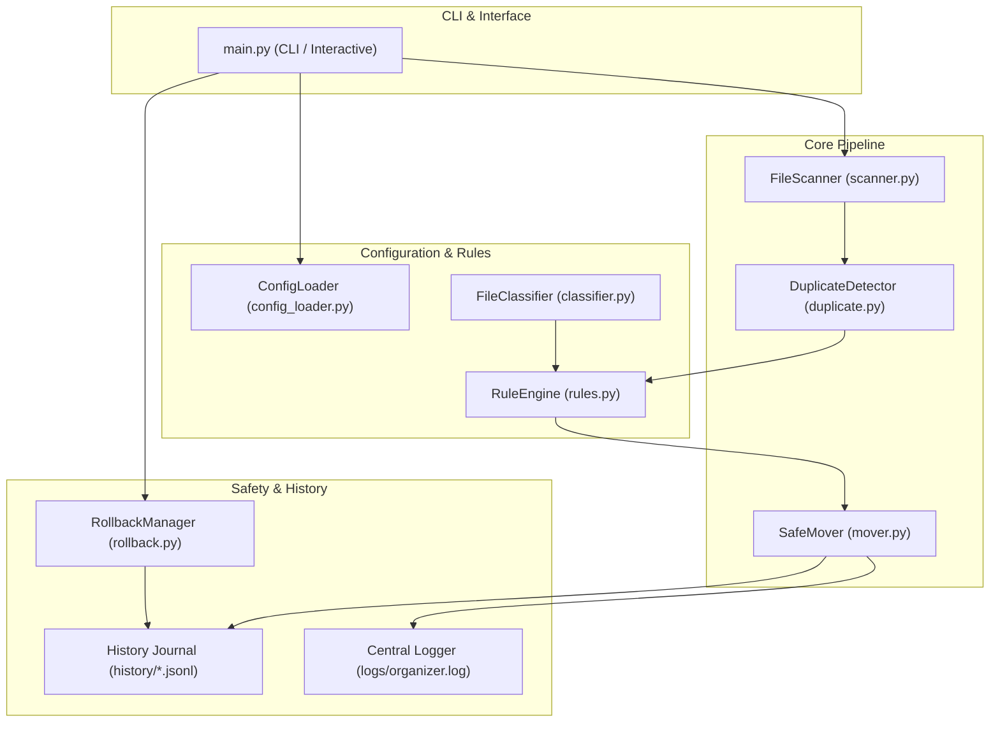

# Enterprise File Organizer

[](https://www.python.org/downloads/)
[](https://opensource.org/licenses/MIT)
[]()
[]()

A safe, reliable, configurable, and extensible cross-platform file management utility engineered with strict data-loss prevention, deterministic rule execution, memory-safe duplicate detection, and transactional rollback capabilities.

---

## Table of Contents
1. [Core Problem Statement](#1-core-problem-statement)
2. [Key Features](#2-key-features)
3. [System Architecture](#3-system-architecture)
4. [Technology Stack & Requirements](#4-technology-stack--requirements)
5. [Project Structure](#5-project-structure)
6. [Installation & Setup](#6-installation--setup)
7. [CLI Commands & Usage](#7-cli-commands--usage)
8. [Interactive Wizard Mode](#8-interactive-wizard-mode)
9. [Configuration System](#9-configuration-system)
10. [Deterministic Rule Priority Pipeline](#10-deterministic-rule-priority-pipeline)
11. [Dry-Run & Preview Mode](#11-dry-run--preview-mode)
12. [Two-Tier Duplicate Detection](#12-two-tier-duplicate-detection)
13. [Filename Conflict & Collision Handling](#13-filename-conflict--collision-handling)
14. [Transactional Rollback System](#14-transactional-rollback-system)
15. [Professional Logging & Auditing](#15-professional-logging--auditing)
16. [Error Handling & Fault Tolerance](#16-error-handling--fault-tolerance)
17. [Safety & Data Loss Prevention Safeguards](#17-safety--data-loss-prevention-safeguards)
18. [Real-Life College Student Example](#18-real-life-college-student-example)
19. [Enterprise Corporate Scenario](#19-enterprise-corporate-scenario)
20. [Automated Testing Suite](#20-automated-testing-suite)
21. [Future Improvements & Extensibility](#21-future-improvements--extensibility)

---

## 1. Core Problem Statement

Users and organizations frequently accumulate thousands of unorganized files in working directories (`Downloads/`, staging folders, desktop directories, shared drives). These files range from invoices, tax documents, assignments, notes, certificates, photographs, design files, spreadsheets, and source code. 

Manually sorting these files is tedious, error-prone, and risks data loss through accidental overwriting or deletion. Standard automation scripts often suffer from:
- Crashing when encountering a single locked file or directory with denied permissions.
- Inadvertently creating infinite loops when the destination directory is a child of the source.
- Silently overwriting existing files with identical names.
- Consuming gigabytes of memory trying to compute hashes of massive video or archive files.
- Providing no means to preview changes or reverse operations when unexpected results occur.

The **Enterprise File Organizer** solves this by treating file safety as the highest engineering priority, combining deterministic classification with non-destructive conflict resolution and transactional rollback.

---

## 2. Key Features

- **Recursive Directory Exploration**: Scans arbitrarily deep directory trees while gracefully skipping inaccessible or permission-restricted folders without crashing.
- **Strict Data-Loss Prevention**: Never silently overwrites or deletes files. Auto-generates indexed filenames (`file_1.ext`, `file_2.ext`) on collisions.
- **Zero Runtime Dependencies**: Operates entirely on Python's standard library (`pathlib`, `os`, `shutil`, `hashlib`, `re`, `json`, `logging`, `argparse`, `datetime`). Runs without internet access.
- **Predictable Rule Precedence**: Evaluates rules deterministically: Explicit Regex > Filename Pattern > Extension > File Size > Modification Date > Default Category.
- **Two-Tier Duplicate Detection**: Optimizes performance by checking exact file sizes first. Chunked SHA-256 (64KB buffers) is only computed when sizes match, preventing RAM exhaustion. Duplicates are strictly reported, never automatically deleted.
- **Comprehensive Dry-Run Mode (`--dry-run`)**: Previews all planned movements, duplicate reports, and categorization metrics without touching the filesystem.
- **Transactional Rollback (`--rollback`)**: Logs every successful operation to a timestamped JSON Lines journal (`history/*.jsonl`) and reverses them in LIFO order while verifying disk state.
- **Dual Logging**: Outputs real-time events to the console (with `--verbose` support) and detailed structured logs to `logs/organizer.log`.
- **Interactive Wizard**: Offers a guided terminal interface with an explicit confirmation step (`[y/N]`, defaulting to NO) before executing changes.

---

## 3. System Architecture



---

## 4. Technology Stack & Requirements

- **Python**: Python 3.11+ (Tested on Python 3.14)
- **Supported Operating Systems**: Windows, Ubuntu, Debian, macOS
- **Filesystem Abstraction**: Standard `pathlib.Path` for cross-platform compatibility
- **Dependencies**:
  - Runtime: **0 external dependencies** (Python standard library only)
  - Testing & Linting: `pytest>=8.0.0`

---

## 5. Project Structure

```
enterprise_file_organizer/
│
├── main.py                     # CLI & Interactive entry point
├── README.md                   # Full system documentation & guides
├── requirements.txt            # Dev/testing tooling dependencies
├── .gitignore                  # Production Python gitignore
├── LICENSE                     # MIT License
│
├── config/
│   ├── default_rules.json      # Standard baseline categories and rules
│   └── example_rules.json      # Sample academic and enterprise rule profiles
│
├── organizer/
│   ├── __init__.py             # Package declaration & metadata (__version__ = 1.0.0)
│   ├── models.py               # Data models (FileInfo, Rule, OperationRecord, Report)
│   ├── exceptions.py           # Domain exception hierarchy
│   ├── logger.py               # Central dual console & file logger
│   ├── utils.py                # Chunked hashing, byte formatting, path sanitization
│   ├── config_loader.py        # Schema validator, regex compiler & merger
│   ├── scanner.py              # Recursive scanner with symlink & cycle guards
│   ├── classifier.py           # Category mapper supporting compound extensions
│   ├── rules.py                # Deterministic multi-tier rule engine
│   ├── duplicate.py            # Two-tier size & SHA-256 duplicate detector
│   ├── mover.py                # Safe mover with collision indexing & preview
│   ├── organizer.py            # High-level pipeline coordinator
│   └── rollback.py             # Transactional reverse-operation engine
│
├── logs/
│   └── .gitkeep                # Directory keep for organizer.log
│
├── history/
│   └── .gitkeep                # Directory keep for history_*.jsonl journals
│
└── tests/
    ├── __init__.py             # Test discovery marker
    ├── test_scanner.py         # Scanner recursion & exclusion tests
    ├── test_classifier.py      # Extension & compound classification tests
    ├── test_rules.py           # Regex, name, size, date, priority tests
    ├── test_duplicate.py       # Two-tier duplicate detection tests
    ├── test_mover.py           # Collision renaming & dry-run tests
    ├── test_rollback.py        # LIFO rollback & error recovery tests
    ├── test_config.py          # Config validation & schema error tests
    ├── test_models.py          # Metadata properties & serialization tests
    └── test_cli.py             # End-to-end integration & CLI tests
```

---

## 6. Installation & Setup

### 1. Clone or Download Repository
```bash
cd enterprise_file_organizer
```

### 2. Verify Python Installation
```bash
python --version
# Output must be Python 3.11 or newer
```

### 3. (Optional) Install Test Tooling
```bash
pip install -r requirements.txt
```

---

## 7. CLI Commands & Usage

### Basic Organization (Dry-Run Preview)
Preview planned movements without touching the disk:
```bash
python main.py /path/to/source /path/to/target --dry-run
```

### Live Organization
Execute file organization (prompts for confirmation before moving):
```bash
python main.py /path/to/source /path/to/target
```

### Verbose Mode
Enable verbose real-time debug statements:
```bash
python main.py /path/to/source /path/to/target --verbose
```

### Custom Configuration Rules
Use a custom JSON rule file:
```bash
python main.py /path/to/source /path/to/target --config config/my_rules.json
```

### Generate Default Configuration File
Generate a clean editable configuration template:
```bash
python main.py --generate-config config/my_rules.json
```

### Rollback Previous Operation
Safely reverse the last organization run:
```bash
python main.py --rollback
```

### Dry-Run Rollback Preview
Preview what files would be restored without moving anything:
```bash
python main.py --rollback --dry-run
```

---

## 8. Interactive Wizard Mode

Running `main.py` with `--interactive` (or without arguments) launches an interactive wizard:

```text
========================================
       ENTERPRISE FILE ORGANIZER        
                v1.0.0                 
========================================

Source directory:
> C:\Users\LOQ\Downloads

Destination directory:
> C:\Users\LOQ\Organized

Configuration file (press Enter for default):
> 

Mode:
1. Dry Run (Preview only)
2. Organize (Perform moves)
3. Rollback
> 2

Proceed with organizing 350 files? [y/N]: y
```

---

## 9. Configuration System

Configurations use standard JSON. The system validates syntax, regex validity, size unit formats, date values, and path safety upon loading.

### Configuration Schema

```json
{
  "conflict_strategy": "rename_auto",
  "categories": {
    "Documents": [".pdf", ".doc", ".docx", ".odt", ".rtf"],
    "Images": [".jpg", ".jpeg", ".png", ".gif", ".bmp", ".svg", ".webp"],
    "Videos": [".mp4", ".mkv", ".mov", ".avi", ".wmv"],
    "Archives": [".zip", ".rar", ".7z", ".tar.gz", ".tar.bz2"],
    "Code": [".py", ".java", ".cpp", ".js", ".ts", ".html", ".css", ".go", ".rs"],
    "Data": [".csv", ".json", ".xml", ".yaml", ".yml", ".sql"]
  },
  "rules": [
    {
      "name": "Tax Invoices",
      "type": "regex",
      "pattern": "^invoice_\\d+\\.(pdf|xlsx)$",
      "destination": "Finance/Invoices",
      "case_sensitive": false
    },
    {
      "name": "Class Assignments",
      "type": "filename",
      "pattern": "assignment",
      "destination": "Education/Assignments"
    },
    {
      "name": "High Definition Footage",
      "type": "size",
      "min_size": "1GB",
      "destination": "Media/Large_Videos"
    },
    {
      "name": "Cold Storage Archive",
      "type": "date",
      "modified_older_than_days": 730,
      "destination": "Archive/Cold"
    }
  ]
}
```

---

## 10. Deterministic Rule Priority Pipeline

When a file is evaluated, the destination is resolved following strict precedence:

```
[Discovered File]
       │
       ▼
1. Explicit Regex Rule?  ───────────► (Yes) ──► Target: Rule Destination
       │ (No)
       ▼
2. Filename Pattern Rule? ──────────► (Yes) ──► Target: Rule Destination
       │ (No)
       ▼
3. Extension / Type Rule? ──────────► (Yes) ──► Target: Rule Destination
       │ (No)
       ▼
4. File Size Rule? ─────────────────► (Yes) ──► Target: Rule Destination
       │ (No)
       ▼
5. Modification Date Rule? ─────────► (Yes) ──► Target: Rule Destination
       │ (No)
       ▼
6. Default Category Fallback ─────────────────► Target: Category Name (e.g. Documents/)
```

---

## 11. Dry-Run & Preview Mode

Before performing disk modifications, `--dry-run` executes a simulation:

```text
========================================
          DRY RUN PREVIEW
========================================
Total planned operations: 4
----------------------------------------
invoice_001.pdf
    Downloads/invoice_001.pdf
    ->
    Organized/Finance/Invoices/invoice_001.pdf

cs101_assignment.docx
    Downloads/cs101_assignment.docx
    ->
    Organized/Education/Assignments/cs101_assignment.docx

family_vacation.mp4
    Downloads/family_vacation.mp4
    ->
    Organized/Videos/family_vacation.mp4

unknown_script.xyz
    Downloads/unknown_script.xyz
    ->
    Organized/Others/unknown_script.xyz
========================================
```

---

## 12. Two-Tier Duplicate Detection

Duplicate detection operates in two tiers:
1. **Tier 1 (Size Grouping)**: All files are grouped by exact byte size. Any file with a unique size is immediately recognized as non-duplicate without reading its content.
2. **Tier 2 (Chunked SHA-256)**: For files with matching sizes, SHA-256 hashes are calculated using 64KB buffers.

### Duplicate Report Output
```text
========================================
        DUPLICATE FILES REPORT
========================================
Total duplicate groups: 1
Redundant duplicate files: 1
Wasted disk storage: 2.45 MB
----------------------------------------
Group #1:
  Size   : 2.45 MB
  SHA256 : 8640d3859bd587496fbf13d371a79e918ef8e62307cc2c1de2e7024dbe63a192
  Original : Downloads/resume.pdf
  Duplicate: Downloads/resume_copy.pdf
========================================
```
> **Note**: Duplicates are never automatically deleted.

---

## 13. Filename Conflict & Collision Handling

When a file is moved to a directory where a file with the same name already exists:
1. **Hash Verification**: If the existing file and incoming file have identical SHA-256 hashes, the redundant file is reported and move is skipped.
2. **Automatic Non-Destructive Renaming**: If contents differ, the incoming file receives an incrementing index:
   - `report.pdf`
   - `report_1.pdf`
   - `report_2.pdf`

---

## 14. Transactional Rollback System

Every successful movement operation is appended to an operation journal in `history/history_YYYYMMDD_HHMMSS.jsonl`.

### Sample Journal Entry
```json
{"source": "C:\\Downloads\\report.pdf", "destination": "C:\\Organized\\Documents\\report.pdf", "timestamp": "2026-09-21T00:40:19.922", "operation": "move", "status": "success", "file_hash": "a1b2c3d4...", "file_size": 245000}
```

### Safety Guarantees During Rollback
- Reverses operations in **LIFO** (Last-In, First-Out) order.
- Verifies destination file still exists before attempting to move.
- Verifies original location is free; if a file already occupies the original spot, rollback **skips** to prevent overwriting.

---

## 15. Professional Logging & Auditing

Logs are recorded in `logs/organizer.log` with timestamps, severity levels, and component tags:

```text
2026-09-21 00:40:19,918 [INFO] EnterpriseOrganizer.Core - Starting organization from 'Downloads' to 'Organized' (Dry-run: False)
2026-09-21 00:40:19,919 [INFO] EnterpriseOrganizer.Scanner - Initiating recursive scan of: Downloads
2026-09-21 00:40:19,922 [INFO] EnterpriseOrganizer.Mover - Successfully moved: Downloads\invoice_1.pdf -> Organized\Finance\Invoices\invoice_1.pdf
2026-09-21 00:40:19,922 [INFO] EnterpriseOrganizer.Core - Saved operation history to history\history_20260921_004019.jsonl
```

---

## 16. Error Handling & Fault Tolerance

The utility is resilient against common filesystem failures:
- `PermissionError`: Logged as warning; skipped gracefully; does not terminate remaining files.
- `FileNotFoundError`: Isolated and logged without application crash.
- `SecurityError`: Rejects any attempt to use path traversal (`../`) or escape target directories.
- `Broken Symlinks`: Safely ignored when `follow_symlinks=False`.

---

## 17. Safety & Data Loss Prevention Safeguards

1. **Target-In-Source Recursion Guard**: If `target` is set inside `source` (e.g., `Downloads/Organized`), the scanner excludes `Organized` from being scanned back into itself.
2. **Never Silently Overwrite**: Collisions automatically index names.
3. **No Automatic Deletion**: Neither organization nor duplicate detection deletes files.
4. **Mandatory Confirmation**: Non-dry-run mode requires typing `y` to proceed. Default is `N`.

---

## 18. Real-Life College Student Example

### Scenario
A college student's `Downloads/` directory has accumulated coursework, media, archives, and duplicate resumes:

#### Before Organization
```
Downloads/
├── Java Notes.pdf
├── Python Notes.pdf
├── assignment1.docx
├── assignment2.docx
├── AWS_certificate.pdf
├── drone.jpg
├── drone_project.png
├── Vihang_video.mp4
├── project.zip
├── resume.pdf
├── resume_final.pdf
└── resume_final_2.pdf
```

#### Execution
```bash
python main.py Downloads/ Student_Organized/
```

#### After Organization
```
Student_Organized/
│
├── Education/
│   └── Assignments/
│       ├── assignment1.docx
│       └── assignment2.docx
│
├── Certificates/
│   └── AWS_certificate.pdf
│
├── Career/
│   └── Resumes/
│       ├── resume.pdf
│       ├── resume_final.pdf
│       └── resume_final_2.pdf
│
├── Documents/
│   ├── Java Notes.pdf
│   └── Python Notes.pdf
│
├── Images/
│   ├── drone.jpg
│   └── drone_project.png
│
├── Videos/
│   └── Vihang_video.mp4
│
└── Archives/
    └── project.zip
```
*(Identical resumes are detected and logged in the duplicate report with SHA-256 hashes).*

---

## 19. Enterprise Corporate Scenario

### Scenario
An enterprise shared folder contains thousands of incoming business files:

- Standardized invoice PDFs (`INV-2026-001.pdf`)
- Quarterly financial spreadsheets (`Q1_report_2026.xlsx`)
- Engineering CAD drawings (`cad_drawing_v3.dwg`)
- HR employee documents (`employee_record_981.pdf`)
- Large disk images and virtual machines (`backup.iso`)

#### Configured Rules
Using `config/example_rules.json`:
- Regex Rule: `^INV-\d{4}-\d+\.pdf$` ➔ `Finance/Invoices/`
- Regex Rule: `^Q[1-4]_report.*` ➔ `Finance/Reports/`
- Filename Rule: `cad_drawing` ➔ `Engineering/Drawings/`
- Filename Rule: `employee_` ➔ `HR/Documents/`
- Size Rule: `> 2GB` ➔ `Storage/Heavy_Files/`
- Date Rule: `> 730 days` ➔ `Cold_Archive/`

#### Organized Directory
```
Corporate_Organized/
│
├── Finance/
│   ├── Invoices/
│   │   └── INV-2026-001.pdf
│   └── Reports/
│       └── Q1_report_2026.xlsx
│
├── Engineering/
│   └── Drawings/
│       └── cad_drawing_v3.dwg
│
├── HR/
│   └── Documents/
│       └── employee_record_981.pdf
│
└── Storage/
    └── Heavy_Files/
        └── backup.iso
```

---

## 20. Automated Testing Suite

The project includes an extensive test suite executed via `pytest`:

```bash
python -m pytest tests/ -v
```

### Test Coverage Breakdown
- `test_scanner.py`: Recursive scanning, subdirectories, metadata accuracy, exclusion of target directory, 0-byte files, invalid paths, and permission error recovery.
- `test_classifier.py`: Extension mapping, compound extensions (`.tar.gz`), case insensitivity, and custom category extensions.
- `test_rules.py`: Strict priority pipeline (Regex > Filename > Extension > Size > Date), regex flags, path matching, size boundaries, and timezone-aware dates.
- `test_duplicate.py`: Two-tier size/hash detection, unique-size hashing skips, duplicate queries, and formatted reports.
- `test_mover.py`: Collision auto-renaming, hash-identical skips, dry-run previews, and path traversal security blocks.
- `test_rollback.py`: Reverse movement, LIFO ordering, occupied original location protection, missing file skips, and summary formatting.
- `test_config.py`: Schema validation, regex verification, size unit errors, negative dates, path traversal rejection, and config merging.
- `test_models.py`: Properties, getters/setters, dictionary round-trip serialization, and metrics computation.
- `test_cli.py`: Command-line interface, summary outputs, and end-to-end organize and rollback cycles.

```text
============================= 57 passed in 0.36s ==============================
```

---

## 21. Future Improvements & Extensibility

The codebase is built with modular interfaces enabling future expansion:
1. **SQLite Database Integration**: Storing persistent metadata, tags, and indexing for enterprise search.
2. **Graphical User Interface (GUI)**: Tkinter or PyQt drag-and-drop dashboard for non-technical users.
3. **Scheduled Background Daemon**: Periodic polling and automatic background sorting of active download folders.
4. **Cloud Storage Adapters**: Abstracting the mover interface to support Amazon S3, Google Cloud Storage, or SFTP.
5. **Machine Learning Classifier**: Text content classification and OCR for scanned documents using lightweight local embeddings.
